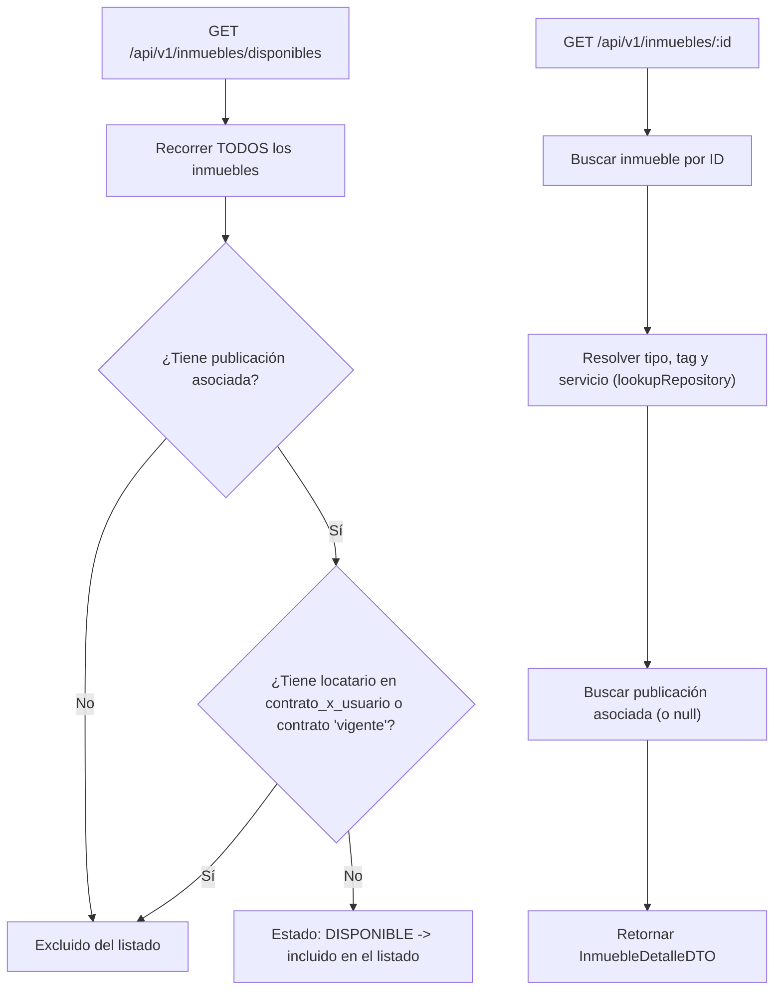
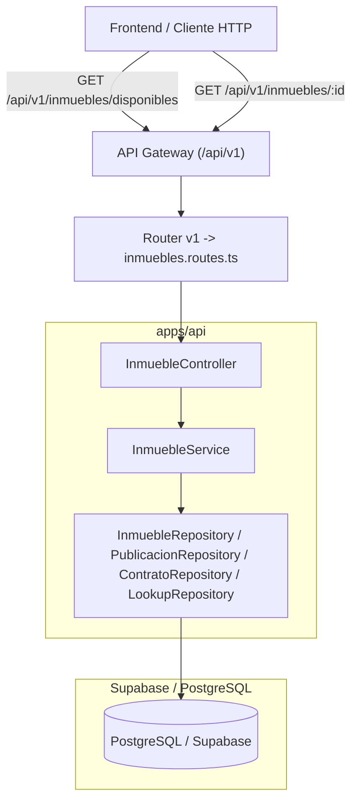

# Plan de Implementación: Consulta de Propiedades a Alquilar (RentAR)

Implementación de dos nuevos endpoints de solo lectura sobre el recurso `inmuebles`, orientados a la búsqueda pública de propiedades: un **listado de propiedades disponibles para alquilar** y el **detalle enriquecido de una propiedad puntual**. Se mantiene el mismo diseño en capas (Controlador, Servicio, Repositorio, DTO) y el API Gateway versionado (`/api/v1/`) ya existentes.

---

## 1. Aclaración del Flujo y Regla de Negocio

### ¿Qué hace `getInmueblesDisponibles()`?
Devuelve únicamente los inmuebles que un locatario podría alquilar hoy:
1. Debe tener una **publicación activa** asociada (`publicacion_repository.findByInmuebleId`). Si el inmueble no tiene publicación, se descarta.
2. Se busca el **contrato principal** del inmueble (el primero asociado).
3. Se considera **alquilado** (y por lo tanto se excluye del listado) si:
   - Existe un usuario asociado al contrato distinto del locador (es decir, hay un locatario pactado), **o**
   - El estado del contrato es `'vigente'`.
4. Si no está alquilado, se incluye en el resultado como propiedad **disponible**.

A diferencia de `getMisInmueblesPublicados` (usado en "Mis Propiedades"), este método no filtra por locador: recorre **todos** los inmuebles del sistema, pensado para la búsqueda pública/catálogo.

### ¿Qué hace `getById(id)` (ampliado)?
Antes devolvía el `InmuebleDTO` crudo (tal cual la tabla `inmueble`). Ahora devuelve un **detalle enriquecido** (`InmuebleDetalleDTO`) pensado para la pantalla de detalle de una propiedad:
- Resuelve la descripción textual del tipo de inmueble, el tag y el servicio (contra `lookupRepository`) en lugar de exponer solo los IDs.
- Incluye los datos de la publicación asociada (`id`, `titulo`, `precio`, `activa`, `created_at`), o `null` si el inmueble no está publicado.



---

## 2. Arquitectura y Componentes



A diferencia del endpoint `/mis-alquileres`, estas dos rutas **no requieren autenticación ni rol** (`authenticateGateway` / `requireRole` no se aplican), ya que están pensadas para consulta pública del catálogo.

---

## 3. Modelo de Datos y DTOs

No se agregaron ni modificaron tablas en Supabase/PostgreSQL: se reutiliza el esquema existente (`inmueble`, `publicacion`, `contrato`, `contrato_x_usuario`, `tipo_inmueble`, `tag_inmueble`, `servicio`).

### DTO nuevo
- **`InmuebleDetalleDTO`**: DTO de respuesta para la vista de detalle de una propiedad.
  - Datos del inmueble (dirección, número, piso, ciudad, ambientes, dormitorios, baños, m2, descripción, `id_locador`, `created_at`)
  - `tipo_inmueble`: descripción del tipo (en lugar del ID crudo)
  - `tag` / `servicio`: descripciones resueltas (o `null`)
  - `publicacion`: objeto con `id`, `titulo`, `precio`, `activa`, `created_at`, o `null` si no está publicado

### DTOs reutilizados (sin cambios de forma)
- `InmuebleDTO`: usado como respuesta de `GET /api/v1/inmuebles/disponibles` (listado, sin enriquecer).
- `ApiResponse<T>`: estructura uniforme de respuesta del Gateway.

---

## 4. Archivos Modificados

```text
SEM-Alq/
└── apps/
    └── api/
        └── src/
            ├── dtos/
            │   └── index.ts                    # + InmuebleDetalleDTO
            ├── services/
            │   └── inmueble.service.ts         # getById() ahora enriquece el detalle
            │                                    # + getInmueblesDisponibles()
            ├── controllers/
            │   └── inmueble.controller.ts       # + getInmueblesDisponibles()
            │                                    # getById() ahora responde InmuebleDetalleDTO
            └── routes/
                └── v1/
                    └── inmuebles.routes.ts       # + GET /inmuebles/disponibles
```

No se tocaron `repositories/*` (se reutilizan los mocks en memoria existentes), ni `gateway/`, ni migraciones de `supabase/`.

> Nota de orden de rutas: `GET /inmuebles/disponibles` se registró **antes** de `GET /inmuebles/:id` en `inmuebles.routes.ts`, para que Express no interprete `"disponibles"` como un valor de `:id`.

---

## 5. Plan de Verificación

1. **Compilación de TypeScript**:
   - `npm run build` en `apps/api` (o `tsc --noEmit`).
2. **Pruebas manuales / automatizadas pendientes**:
   - **`GET /api/v1/inmuebles/disponibles`**:
     - Debe excluir inmuebles sin publicación asociada.
     - Debe excluir inmuebles con contrato `vigente` o con locatario asociado en `contrato_x_usuario`.
     - Debe incluir inmuebles publicados sin locatario pactado.
   - **`GET /api/v1/inmuebles/:id`**:
     - Debe devolver `tipo_inmueble`, `tag` y `servicio` como texto descriptivo (no IDs).
     - Debe devolver `publicacion: null` si el inmueble no tiene publicación activa.
     - Debe devolver 404 (según `error.middleware.ts`) si el `id` no existe.
   - Agregar los casos anteriores a `tests/api/` siguiendo el patrón de `mis-alquileres.test.ts`.
