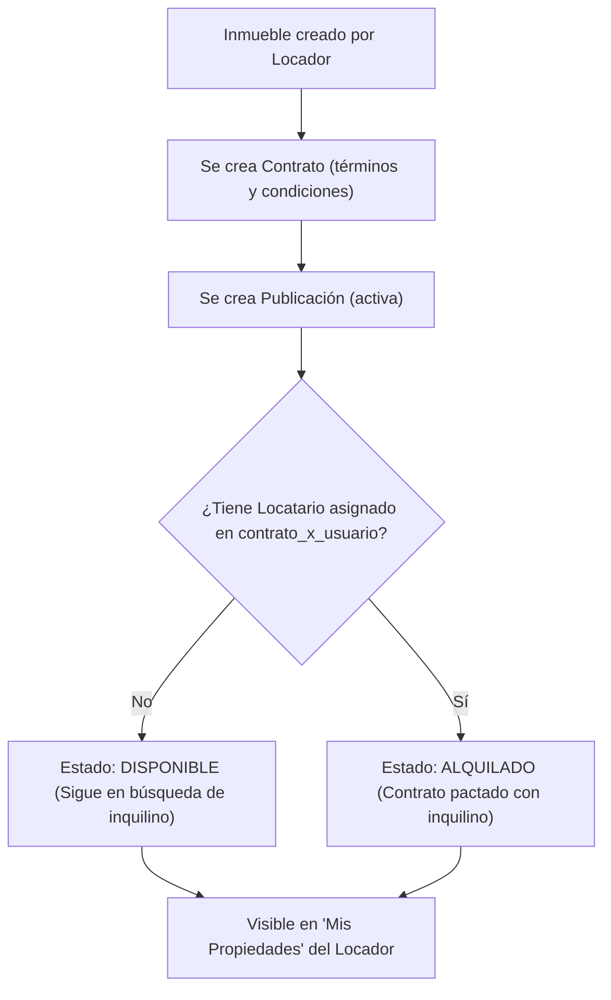
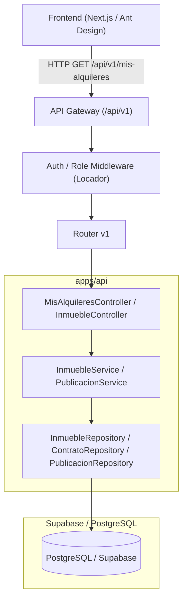

# Plan de Implementación: Backend para Gestión de Alquileres (RentAR)

Implementación de la arquitectura de backend desacoplada mediante un **API Gateway** versionado (`/api/v1/`), con diseño en capas (Controladores, Servicios, Repositorios, DTOs) y soporte para base de datos relacional (Supabase / PostgreSQL).

El objetivo principal es permitir que un usuario con rol **locador** pueda iniciar sesión y visualizar en la pantalla **"Mis Propiedades"** (`/api/v1/mis-alquileres`) el listado completo de **todas sus propiedades publicadas para alquilar**, independientemente de si ya se encuentran alquiladas (contrato pactado con un locatario) o si siguen disponibles para alquilar.

---

## 1. Aclaración del Flujo y Regla de Negocio

### ¿Qué hace `getMisInmueblesPublicados(idLocador: number)`?
1. **Regla de Publicación**: No se puede publicar un inmueble sin asociarle un contrato (el contrato define los términos de alquiler, monto base, duración y condiciones requeridas por el locador).
2. **Visualización en "Mis Propiedades" para el Locador**:
   - El locador debe ver **todos los inmuebles que dio de alta y publicó**.
   - **No se limita a propiedades que ya tengan inquilino**. El listado incluye:
     - **Propiedades disponibles**: Tienen su publicación activa y contrato base creado, pero aún no se ha pactado/firmado con un locatario (o no tienen `contrato_x_usuario` con rol locatario asignado).
     - **Propiedades alquiladas**: Ya cuentan con un contrato celebrado/pactado con un locatario específico.
   - El DTO devuelto (`MisAlquileresDTO` / `InmuebleDetalleDTO`) incluirá un campo de estado (`estado_alquiler`: `'disponible'` | `'alquilado'`), permitiéndole al locador distinguir rápidamente qué propiedades están ocupadas y cuáles siguen en oferta.



---

## 2. Arquitectura y Componentes



---

## 3. Modelo de Datos y DTOs

### Tablas a crear en Supabase / PostgreSQL:
- `tipo_inmueble`: `id` (SERIAL PK), `descripcion` (VARCHAR)
- `tags_inmueble`: `id` (SERIAL PK), `descripcion` (VARCHAR)
- `servicios`: `id` (SERIAL PK), `nombre` (VARCHAR), `descripcion` (VARCHAR)
- `rol`: `id` (SERIAL PK), `nombre` (VARCHAR), `descripcion` (VARCHAR)
- `usuario`: `id` (SERIAL PK), `nombre`, `email` (UNIQUE), `telefono`, `created_at`
- `usuario_x_rol`: `id` (SERIAL PK), `id_usuario` (FK), `id_rol` (FK)
- `inmueble`:
  - `id` (SERIAL PK, **autogenerado**)
  - `tipo` (INT FK a `tipo_inmueble.id`)
  - `direccion` (VARCHAR)
  - `numero` (INT)
  - `piso` (VARCHAR)
  - `ciudad` (VARCHAR)
  - `ambientes` (INT)
  - `dormitorios` (INT)
  - `banos` (INT)
  - `m2` (INT)
  - `descripcion` (VARCHAR)
  - `tags` (INT FK a `tags_inmueble.id`)
  - `id_locador` (INT FK a `usuario.id`)
  - `servicios` (INT FK a `servicios.id`)
  - `created_at` (TIMESTAMP)
- `contrato`: `id` (SERIAL PK), `id_inmueble` (INT FK a `inmueble.id`), `fecha_inicio` (DATE), `fecha_fin` (DATE), `monto` (NUMERIC), `estado` (VARCHAR: `'borrador' | 'disponible' | 'vigente' | 'finalizado'`), `created_at`
- `contrato_x_usuario`: `id` (SERIAL PK), `id_contrato` (INT FK a `contrato.id`), `id_usuario` (INT FK a `usuario.id`)
- `publicacion`: `id` (SERIAL PK), `id_inmueble` (INT FK a `inmueble.id`), `titulo` (VARCHAR), `precio` (NUMERIC), `activa` (BOOLEAN DEFAULT TRUE), `created_at`

### DTOs definidos (uno por tabla + DTO de respuesta para frontend):
1. `TipoInmuebleDTO`
2. `TagsInmuebleDTO`
3. `ServiciosDTO`
4. `RolDTO`
5. `UsuarioDTO`
6. `UsuarioXRolDTO`
7. `InmuebleDTO` (y `CreateInmuebleDTO`, `UpdateInmuebleDTO`)
8. `ContratoDTO` (y `CreateContratoDTO`)
9. `ContratoXUsuarioDTO`
10. `PublicacionDTO` (y `CreatePublicacionDTO`)
11. `MisAlquileresDTO` / `InmuebleDetalleDTO`: DTO enriquecido para la vista del frontend con:
    - Datos del inmueble (dirección, número, piso, ciudad, ambientes, dormitorios, baños, m2, descripción)
    - Descripción del tipo de inmueble, nombre de servicios, descripción de tags
    - Datos de la publicación (id publicación, precio, fecha publicación)
    - Datos del contrato y estado del alquiler (`'disponible'` vs `'alquilado'`)

---

## 4. Estructura de Archivos a Crear

```text
SEM-Alq/
├── apps/
│   └── api/
│       ├── package.json
│       ├── tsconfig.json
│       └── src/
│           ├── config/
│           │   ├── database.ts
│           │   └── swagger.ts
│           ├── gateway/
│           │   ├── gateway.router.ts
│           │   └── middlewares/
│           │       ├── auth.middleware.ts
│           │       └── error.middleware.ts
│           ├── dtos/
│           │   └── index.ts
│           ├── repositories/
│           │   ├── inmueble.repository.ts
│           │   ├── contrato.repository.ts
│           │   ├── publicacion.repository.ts
│           │   └── lookup.repository.ts
│           ├── services/
│           │   ├── inmueble.service.ts
│           │   └── publicacion.service.ts
│           ├── controllers/
│           │   ├── inmueble.controller.ts
│           │   └── mis-alquileres.controller.ts
│           ├── routes/
│           │   └── v1/
│           │       ├── index.ts
│           │       ├── inmuebles.routes.ts
│           │       └── mis-alquileres.routes.ts
│           ├── app.ts
│           └── server.ts
├── packages/
│   └── shared-types/
│       ├── package.json
│       ├── tsconfig.json
│       └── src/
│           └── index.ts
├── supabase/
│   ├── migrations/
│   │   └── 20260918000000_init_rentar_schema.sql
│   └── seed.sql
└── tests/
    └── api/
        └── mis-alquileres.test.ts
```

---

## 5. Plan de Verificación

1. **Compilación de TypeScript**:
   - `npm run build` o `tsc --noEmit` en `packages/shared-types` y `apps/api`.
2. **Pruebas Automatizadas**:
   - **Prueba CRUD de Inmuebles**: Alta de propiedad con generación automática del `id`, lectura, actualización y eliminación.
   - **Prueba de Regla de Publicación**: Intento de publicar un inmueble sin contrato asociado debe ser rechazado con error descriptivo (HTTP 400).
   - **Prueba de "Mis Alquileres"**: Un locador consulta `/api/v1/mis-alquileres` y recibe:
     - Propiedades publicadas aún sin inquilino (estado: `disponible`).
     - Propiedades publicadas ya pactadas con contrato a un inquilino (estado: `alquilado`).
     - No recibe propiedades pertenecientes a otros locadores.
   - **Prueba de API Gateway**: Acceso versionado `/api/v1/` y documentación Swagger en `/api/v1/docs`.
